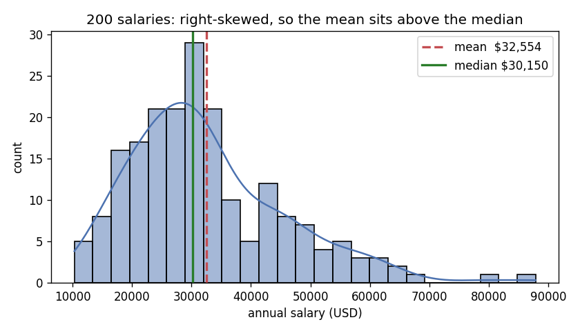
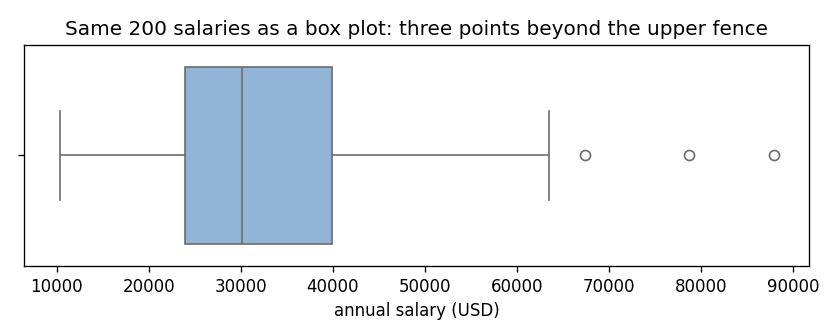

## Learning Objectives

By the end of this lesson you will be able to:

- **Enumerate** the goals of EDA and place it in the data-science process. *(Understand)*
- **Compute and interpret** summary statistics — mean, median, standard deviation, quartiles — and explain when the mean misleads. *(Apply / Analyze)*
- **Generate and read** a histogram, a KDE, and a box plot, naming shape, spread, skewness, and outliers. *(Apply)*
- **Flag** candidate outliers with the 1.5 x IQR rule and decide what (not) to do with them. *(Analyze)*

> **Where this sits:** after **L06 — Computing at Scale** (which closed Unit II) · opens **Unit III — Exploratory Data Analysis** · before **L08 — Correlation & Bivariate Analysis**.

> **Hands-on:** [Lab — Exploring Penguins, One Variable at a Time](l07_lab_univariate_eda.md) ·
> [](https://colab.research.google.com/github///blob//u03_eda/l07_lab_univariate_eda.ipynb)

## Why This Matters

A billionaire walks into a bar. The *mean* wealth of the patrons jumps to the hundreds of
millions; the *median* barely moves. Nobody in the bar got richer — one number just lied
to you, and the other didn't.

Real data plays the same trick constantly. Income is the classic case: in Puerto Rico, as
in most economies, mean household income runs well above the median, because income is
**right-skewed** — many modest values, a long tail of large ones. Quote the mean and you
flatter the typical household; quote the median and you describe it.

The fix is not a better formula. It is **looking at the data before trusting any single
number about it**. That habit has a name — *exploratory data analysis* — and John Tukey,
who coined it, compressed it into one rule: look first, model later.

## What EDA Is

::: {.callout-note title="Definition"}
**Exploratory data analysis (EDA)** is the stage where you summarize and visualize a
dataset *before* modeling — to learn its shape, spot its problems, and let it suggest
hypotheses, instead of imposing yours on it untested.
:::

Concretely, EDA's goals are to:

1. **Understand structure** — how many rows and columns, what types, what units.
2. **Assess quality** — missing values, duplicates, impossible values.
3. **See distributions** — center, spread, shape, and outliers of each variable.
4. **Find relationships** — how variables move together (next lesson).
5. **Generate hypotheses** — questions worth modeling, and ones not worth it.

In the process loop from L01, EDA spans stages 3 and 4 — it is where cleaning and
exploring feed each other:

```{mermaid}
flowchart LR
    Q[1. Question] --> A[2. Acquire] --> C[3. Clean] --> E[4. Explore / Model] --> K[5. Communicate]
    E -. new questions .-> Q
    C -. data gaps .-> A
    style C fill:#fff3cd
    style E fill:#fff3cd
```

This unit teaches the two working halves of EDA: **one variable at a time** (this
lesson: summary statistics and distribution plots) and **two variables together** (L08:
correlation and bivariate plots). The field's name gets attached to much more — text
mining, geospatial analysis, dimensionality reduction — and those are real, but they
live in later units (IV and V) or beyond this course's scope. EDA is not a fixed
checklist; it is the discipline of looking.

## Summary Statistics

The numeric vocabulary first. For a variable $x_1, x_2, \ldots, x_n$:

| Measure | Of what | Definition | Robust to outliers? |
|---------|---------|------------|---------------------|
| **Mean** $\bar{x}$ | center | $\frac{1}{n}\sum_i x_i$ | no — every value pulls it |
| **Median** | center | middle value when sorted | **yes** |
| **Mode** | center | most frequent value | yes (categorical center) |
| **Range** | spread | $\max - \min$ | no — defined *by* the extremes |
| **Variance** $s^2$ | spread | $\frac{1}{n-1}\sum_i (x_i - \bar{x})^2$ | no |
| **Std. deviation** $s$ | spread | $\sqrt{s^2}$ — same units as $x$ | no |
| **Percentile** $P_k$ | position | value below which $k\%$ of the data falls | yes |
| **Quartiles** Q1, Q2, Q3 | position | the 25th, 50th, 75th percentiles (Q2 = median) | yes |
| **IQR** | spread | $Q3 - Q1$ — the span of the middle 50% | **yes** |

The **robust** column is the one to internalize: the mean, variance, and range can be
dragged arbitrarily far by a single extreme value; the median and IQR cannot. Neither
family is "better" — they answer different questions, and *disagreement between them is
information*.

### A worked example

Two hundred simulated annual salaries, drawn from a right-skewed (lognormal)
distribution — the shape real salaries actually have:

```python
import numpy as np

rng = np.random.default_rng(7)
salaries = np.round(rng.lognormal(mean=np.log(32000), sigma=0.45, size=200), -2)
print(f"mean  : ${salaries.mean():,.0f}")
print(f"median: ${np.median(salaries):,.0f}")
```

```
mean  : $32,554
median: $30,150
```

The mean is **$2,400 above** the median. With the bar-patron story in mind you can
already guess why — and one picture confirms it.



**Reading the output:** the bulk of salaries sits between \$20k and \$40k, but the tail
stretches past \$80k. Those few large values pull the mean to the right of the median —
the classic signature of **right skew** (skewness here is +1.07; symmetric data would be
near 0). For this variable, "typical salary" should be reported as the median.

::: {.callout-warning title="When the mean misleads"}
**Use the mean when** the distribution is roughly symmetric and you need the value that
plays well algebraically (sums, totals, averages of averages).
**Prefer the median when** the data is skewed (income, house prices, hospital stays,
response times) or contaminated by outliers — any time "typical" is the question.
A mean far from its median is itself a finding: go look at the shape.
:::

## Pictures of One Variable

`describe()` compresses a variable to eight numbers. The three plots below are how you
check what the compression threw away.

### Histogram

Divide the value range into **bins**, count values per bin, draw the counts. The
histogram in the figure above is the salary data's: it shows *shape* (skewed right),
*spread* (about \$10k to \$88k), and *modality* (one peak — unimodal). The one parameter
that matters is the bin count: too few bins blur structure, too many shatter it into
noise. There is no universally correct value — try a few; the lab makes this concrete.

### KDE (kernel density estimate)

The smooth curve overlaid on the histogram is a **KDE**: an estimate of the
distribution's density that replaces bins with a smooth local average. It avoids binning
artifacts and makes multiple peaks easier to see, at the cost of a smoothing parameter
(the *bandwidth*) that can blur real structure or invent wiggles, and a vertical axis
(density) that no longer reads as a count. Histogram and KDE answer the same question;
showing both, as above, is common practice.

### Box plot

The box plot draws the **five-number summary** — min, Q1, median, Q3, max — as a box
(Q1 to Q3, line at the median) with whiskers, plus a convention for flagging outliers:

::: {.callout-important title="The 1.5 x IQR rule"}
Points below $Q1 - 1.5 \times IQR$ or above $Q3 + 1.5 \times IQR$ are drawn as
individual dots — **candidate** outliers. The whiskers extend only to the most extreme
points *inside* those fences. The rule is a flagging convention (Tukey's), not a verdict:
a dot means "look at me", never "delete me".
:::



**Reading the output:** same data, third view. The median line sits left of the box's
center and the right whisker is much longer than the left — skew again, now visible
without any tail to draw. Three salaries (out of 200) fall beyond the upper fence of
$63,862 and are drawn as dots: plausible high earners, flagged for attention, not for
deletion.

## Categorical Counts

Means and histograms need numbers. For a **categorical** variable (species, island,
product type) the distribution is just the count per category — `value_counts()` in
pandas — and its picture is the **bar chart**: one bar per category, height = count,
drawn with gaps between bars (unlike the histogram, whose touching bars signal a
continuous axis).

A **pie chart** shows the same counts as slices of a circle. It is defensible when there
are two or three categories and the message is "share of the whole"; beyond that, humans
compare bar lengths far more accurately than angles — when in doubt, bar chart.

## Common Pitfalls

- **Trusting `describe()` without plotting.** Identical summary tables can hide wildly
  different shapes (L08 opens with the famous proof — four datasets, same statistics,
  four different pictures).
- **Reading histogram artifacts as structure.** A "gap" or "second peak" that appears at
  one bin count and vanishes at another is the binning, not the data.
- **Deleting flagged outliers.** The 1.5 x IQR rule flags *candidates*. An extreme value
  may be a typo (fix it), a sensor error (drop it, and say so), or the most important
  observation in the dataset (a fraud, a hurricane, a billionaire — keep it).
- **Forgetting missing values.** `mean()`, `median()`, and friends silently skip `NaN`s
  in pandas — count the missing values *first* so you know what fraction of the column
  your statistics actually describe.

## Quiz Hooks

*Feeds the retrieval quiz at the start of the next session.*

- The goals of EDA and where it sits in the process loop <!-- obj 1 · Understand · Moodle MC -->
- Mean above the median: what does it signal, which should you report? <!-- obj 2 · Analyze · Moodle MC -->
- Match the plot to the question (histogram / box plot / bar chart) <!-- obj 3 · Apply · Moodle MC -->

## FAQ / Industry Reality

**"Isn't EDA just making pretty plots?"** — The plots are the *method*, not the product.
Professional EDA ends in decisions: which variables are usable, which need cleaning,
which hypotheses deserve a model. A figure nobody draws a conclusion from is decoration.

**"Why not skip ahead to the model?"** — Because the model will happily train on garbage.
Missing values, skew, and outliers don't announce themselves in the model's accuracy; they
just quietly bias the result. An hour of EDA is the cheapest insurance in the pipeline —
and in practice it is where most real datasets reveal that the *question* needs changing.

## Cheat-sheet

| You want to know... | Numbers | Picture |
|---------------------|---------|---------|
| Typical value (symmetric data) | mean | histogram |
| Typical value (skewed data) | **median** | histogram + KDE |
| Spread | std (symmetric) · IQR (skewed) | box plot |
| Shape: skew, peaks | skewness; mean vs median | histogram + KDE |
| Outlier candidates | 1.5 x IQR fences | box plot dots |
| Category frequencies | `value_counts()` | bar chart |

## Where to Go Deeper

- **Book chapter:** [R for Data Science — Exploratory Data Analysis](https://r4ds.hadley.nz/eda) — the same discipline, language-agnostic ideas.
- **Official docs:** [pandas — descriptive statistics](https://pandas.pydata.org/docs/user_guide/basics.html#descriptive-statistics) · [seaborn — visualizing distributions](https://seaborn.pydata.org/tutorial/distributions.html).
- **Classic reference:** Tukey, J. W. (1977). *Exploratory Data Analysis*. Addison-Wesley — where the box plot, the fences, and the "look first" doctrine come from.
