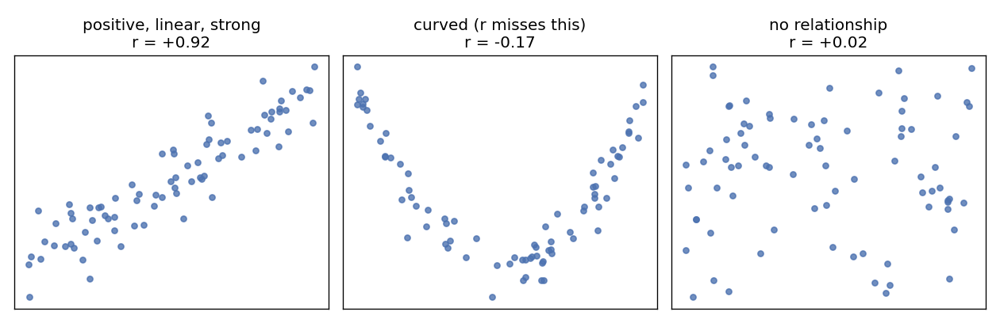
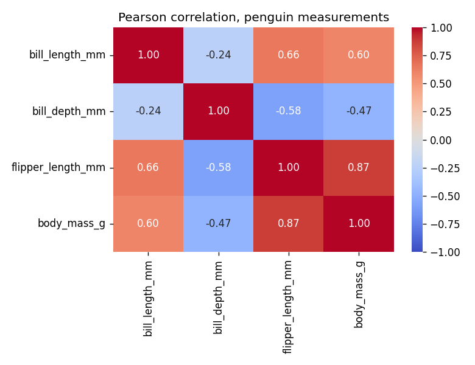

## Learning Objectives

By the end of this lesson you will be able to:

- **Generate and read** a scatter plot — direction, form, strength, and the points that don't fit. *(Apply)*
- **Compute and interpret** Pearson's r, and recognize when Spearman's rank correlation is the honest choice. *(Apply / Analyze)*
- **Compare** group distributions with grouped box plots and read a correlation heatmap. *(Apply)*
- **Critique** a correlation claim — causation, confounders, and Simpson's paradox. *(Evaluate)*

> **Where this sits:** after **L07 — One Variable at a Time** · completes Unit III's EDA toolkit · the planned unit closer is an EDA mini-project.

> **Hands-on:** [Lab — Penguin Relationships & a Paradox](l08_lab_bivariate_correlation.md) ·
> [](https://colab.research.google.com/github///blob//u03_eda/l08_lab_bivariate_correlation.ipynb)

## Why This Matters

L07 closed with a warning: identical summary tables can hide wildly different shapes.
Here is the canonical proof, built by the statistician Francis Anscombe in 1973. Four
small datasets. Same mean of x (9.0), same mean of y (7.5), same variances — and the
same correlation, r = 0.82, to two decimal places:


**Reading the output:** only dataset I is what "r = 0.82" makes you imagine. II is a
*curve* — a perfect relationship that r understates. III is a perfect *line* hijacked by
a single outlier. IV has *no* relationship at all — one extreme point manufactures the
whole statistic. Four identical summaries, four different stories.

L07 taught you to picture one variable before trusting its summary. This lesson does
the same for **pairs** of variables: the picture is the scatter plot, the summary is
correlation, and the discipline is reading both — then refusing the causal leap.

## Reading a Scatter Plot

One point per row; x one variable, y the other. You read it with four words:

| Ask | Vocabulary | What to look at |
|-----|------------|-----------------|
| **Direction** | positive / negative / none | does y rise or fall as x grows? |
| **Form** | linear / curved / clustered | could a straight line describe it? |
| **Strength** | strong / moderate / weak | how tightly do points hug the form? |
| **Unusual points** | outliers, separate clouds | who doesn't follow the pattern? |



**Reading the output:** the first panel is what correlation measures well. The middle
panel is the trap — an obvious, strong relationship (a parabola) that r calls "-0.17,
basically nothing", because the rule it checks is *linear*. The right panel is genuine
noise. The plot distinguishes the last two; the number alone cannot.

## Measuring It: Pearson's r

How do we put a number on "they move together"? The raw idea is **covariance**: for
each penguin/row, multiply how far x is above its mean by how far y is above its mean,
and average. Both above or both below the means gives positive products, hence
positive covariance. The
problem: its value depends on the units (grams? kilograms?), so "big" is meaningless.

**Pearson's correlation coefficient** fixes the units by dividing out both standard
deviations:

$$
r = \frac{\sum_i (x_i - \bar{x})(y_i - \bar{y})}{\sqrt{\sum_i (x_i - \bar{x})^2}\,\sqrt{\sum_i (y_i - \bar{y})^2}}
$$

That forces $-1 \le r \le +1$, with the sign giving direction and the magnitude giving
strength of the **linear** relationship:

| r (magnitude) | Conventional read |
|----------------|-------------------|
| 0.9 to 1.0 | very strong |
| 0.7 to 0.9 | strong |
| 0.4 to 0.7 | moderate |
| 0.1 to 0.4 | weak |
| 0.0 to 0.1 | none detected |

These bands are *conventions, not laws* — in physics r = 0.7 may be embarrassingly
weak; in social science it may be a career. And the bands assume you already looked at
the scatter, because of r's three blind spots:

- **Linear only.** Anscombe II (and the parabola above): a real, strong, curved
  relationship can score near zero. *r = 0 does not mean "unrelated".*
- **Outlier-sensitive.** Anscombe III and IV: one point can inflate, deflate, or
  entirely fabricate r — it is built from means and variances, which L07 showed are
  not robust.
- **Blind to groups.** A mixture of subgroups can produce an r that describes *none*
  of them — the trap of this lesson's final section.

### Spearman: correlation on the ranks

**Spearman's rank correlation** sorts each variable, replaces values with their ranks
(1st, 2nd, 3rd...), then computes Pearson on the ranks. It answers a looser, often more
honest question: *does y consistently move in one direction as x grows* — linearly or
not?

A series that doubles every step makes the difference concrete:

```python
x = pd.Series(range(1, 11))
y = pd.Series(2.0 ** x)   # doubles every step: monotone but curved
print(f"Pearson : {x.corr(y):.2f}")
print(f"Spearman: {x.corr(y, method='spearman'):.2f}")
```

```
Pearson : 0.80
Spearman: 1.00
```

**Reading the output:** the relationship is *perfectly* monotone — every step up in x
is a step up in y — and Spearman says exactly that (1.00), while Pearson docks it to
0.80 for the crime of not being a straight line. **Prefer Spearman when** the scatter
is monotone but curved, the data is ordinal (rankings, survey scales), or outliers are
present (ranks tame them). **Stay with Pearson when** the scatter actually looks
linear — it then uses more of the information.

## Many Variables at Once

With four numeric columns there are six pairs — nobody reads six scatters one by one.
Two tools scale the view up:

**Correlation matrix + heatmap.** `df.corr()` computes r for every pair; a heatmap
colors the grid so the strong cells jump out. The matrix is symmetric with a diagonal
of 1.00 (everything correlates perfectly with itself) — read one triangle:



**Reading the output:** flipper length and body mass at **0.87** is the standout —
bigger penguins on both ends, as you would expect. The strange cells are bill depth's
entire *row*: negative against everything, including **-0.47** with body mass. Deeper
bills on *lighter* penguins? That cell is hiding something, and the lab makes you
catch it in the act.

**Pair plot.** `sns.pairplot()` draws every pairwise scatter in a grid, with each
variable's distribution on the diagonal — L07's histogram and this lesson's scatter,
fused into one overview figure. It is the standard first picture of a new numeric
dataset (and the lab's Exercise 2).

## Comparing Groups: Numeric vs Categorical

When one variable is categorical (species, island), "relationship" means *do the
distributions differ across groups* — and the tool is L07's box plot, **grouped**: one
box per category, side by side. Differences in medians, spreads, and flagged points
become visible at a glance. The **violin plot** is the same idea with each box replaced
by a mirrored KDE, showing the full distribution shape per group.

::: {.callout-note collapse="true" title="Deep Dive: violin plots and KDE caveats (optional)"}
A violin is a box plot wearing L07's KDE, so the KDE caveats carry over: the smoothing
bandwidth can invent bumps or erase real ones, especially in small groups (Chinstrap
has only 68 penguins), and the violin's width axis is density, not count. For a quick
group comparison the box plot is usually enough; reach for the violin when the *shape*
within groups (bimodality, skew) is the question. A third sibling, Kendall's tau, does
for correlation what the violin does for boxes — a rank-based alternative to Spearman
with better small-sample behavior; this course doesn't need it, but you'll meet it in
references.
:::

## Correlation Is Not Causation

The most quoted sentence in statistics, and Unit III's exit exam for judgment. When x
and y correlate, there are always (at least) three candidate explanations:

1. **x causes y** — flipper muscles really do add mass.
2. **y causes x** — reverse: mass changes flipper measurements.
3. **Something else causes both** — a **confounder** (or *lurking variable*) moves the
   pair together without either touching the other. Ice-cream sales correlate with
   drownings; the confounder is summer.

A correlation alone cannot pick between the three — that takes experiments or
domain knowledge. EDA's job is to *surface* the candidates, and the most spectacular
way a confounder shows itself is:

::: {.callout-important title="Simpson's paradox"}
A correlation (or trend) that holds in every subgroup can **disappear — or reverse —
when the groups are pooled**. The penguins deliver a textbook case: bill depth vs body
mass has overall r = **-0.47**, yet *within every single species* the correlation is
**positive** (+0.58, +0.60, +0.72). Same lurking variable as L07's bimodal histogram —
species — now flipping a sign instead of adding a hump. The lab walks you through
producing and unmasking it.
:::

The practical rule: **never report a correlation for pooled data without checking the
obvious groupings first** (`groupby` + per-group r, or a hue-colored scatter).

## Common Pitfalls

- **The causal leap.** "r = 0.87, so flippers cause mass" — nothing in the number
  supports the verb. Say "associated", then argue causation separately, if at all.
- **Correlating aggregates.** Correlations computed on group *averages* (per-island
  means, per-year totals) are routinely much stronger than the same correlation at the
  individual level — averaging washes out the noise — and can even differ in sign.
  Say which level your r describes; conclusions about individuals need individual data.
- **Cherry-picking the matrix.** Compute 20 variables' worth of pairs and *some* cell
  will show |r| > 0.5 by luck alone. Treat heatmap findings as leads, not conclusions.
- **Quoting r without asking "could this be chance?"** In a small sample, a sizable r
  can arise from luck even between unrelated variables. The formal check is a
  *significance test* (a p-value for r) — it exists, and this course teaches it later;
  for now, treat small-sample correlations as provisional.
- **Extrapolating the form.** A linear read holds *inside* the observed range; beyond
  it you have hope, not evidence.

## Quiz Hooks

*Feeds the retrieval quiz at the start of the next session.*

- Read a described scatter (direction / form / strength) and pick the matching r <!-- obj 1-2 · Apply · Moodle MC -->
- When Spearman beats Pearson (monotone curve / ordinal / outliers) <!-- obj 2 · Analyze · Moodle MC -->
- A Simpson's-paradox scenario: which conclusion is justified? <!-- obj 4 · Evaluate · Moodle MC -->

## FAQ / Industry Reality

**"Is r = 0.9 always better evidence than r = 0.5?"** — Better evidence *of linear
association in your sample*, yes. But an r = 0.9 from ten cherry-picked points, a
pooled mixture, or one outlier (Anscombe IV!) is worth less than an honest 0.5 from
clean, plotted, group-checked data. The number's pedigree matters more than its size.

**"My heatmap shows 0.97 between two features — jackpot?"** — More often a red flag:
near-perfect correlation usually means the two columns encode the *same thing* (mass
in grams and in kilograms, price and price-with-tax). In modeling that redundancy
causes trouble; the professional reflex to a 0.97 cell is "which one do I drop?", not
"what a discovery".

## Cheat-sheet

| Question | Plot | Number |
|----------|------|--------|
| Do two numeric variables move together? | scatter plot | Pearson's r |
| ...monotone but curved? ordinal? outliers? | scatter plot | **Spearman** |
| Which pairs matter, among many? | heatmap / pair plot | correlation matrix |
| Does a numeric variable differ by group? | grouped box plot (violin for shape) | per-group medians |
| Is the pooled correlation honest? | scatter with `hue=` group | per-group r vs overall r |
| Two categorical variables? | stacked / grouped bar chart | counts (beyond this course) |

## Where to Go Deeper

- **Book chapter:** [R for Data Science — Exploratory Data Analysis](https://r4ds.hadley.nz/eda) — covariation, the same discipline in another language.
- **Official docs:** [pandas — `DataFrame.corr`](https://pandas.pydata.org/docs/reference/api/pandas.DataFrame.corr.html) · [seaborn — visualizing pairwise relationships](https://seaborn.pydata.org/tutorial/relational.html).
- **Classics:** Anscombe, F. J. (1973). "Graphs in Statistical Analysis", *The American Statistician* 27(1) — the quartet's original paper · [Spurious Correlations (tylervigen.com)](https://www.tylervigen.com/spurious-correlations) — an entire gallery of confounders and coincidences.
