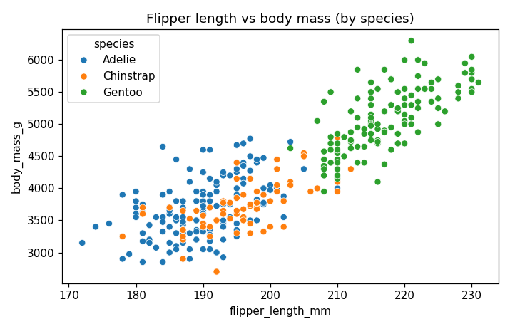
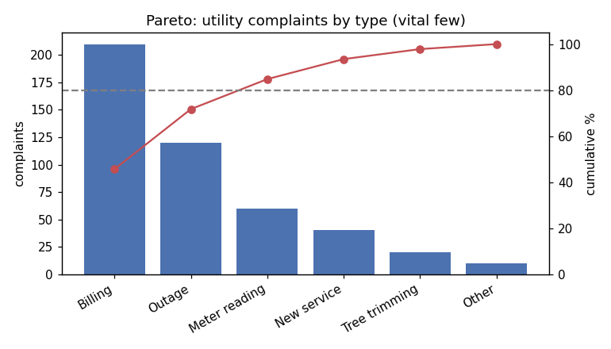
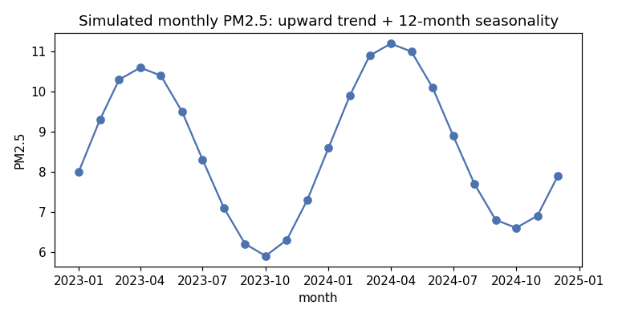

## Learning Objectives

By the end of this lesson you will be able to:

- **Read** a scatter plot -- direction, form, strength, and the points that do not fit -- without leaping to a number. *(Apply / Analyze)*
- **Build and read** a Pareto diagram and name the "vital few" from its cumulative line. *(Apply)*
- **Read** a time-dependent plot for level, trend, seasonality, and spikes -- by eye, no model. *(Apply / Analyze)*
- **Choose** the right plot for a question, including many-variable views (parallel coordinates, star). *(Evaluate)*

> **Hands-on:** [Lab — A Catalogue of EDA Plots](l09_lab_eda_visual_methods.md) ·
> 

> **Where this sits:** after **L08 — Univariate Analysis** (one variable's numbers and plots) · before **L10 — the EDA Mini-Project** (the full loop) · closes Unit III's EDA toolkit.

## Why This Matters

L08 ended with a warning: identical summary tables can hide wildly different shapes. Here is the
canonical proof, built by the statistician Francis Anscombe in 1973. Four small datasets with **the same**
mean of x (9.0), mean of y (7.5), variances, *and* the same correlation (0.82 -- a number you will put to
work in **L19**):

**Reading the output:** only dataset I is what those identical summaries make you imagine. II is a *curve*.
III is a *line* hijacked by one outlier. IV has *no* genuine trend -- one distant point manufactures the
fitted line. Four identical summaries, four different stories. The lesson's thesis in one figure:
**summaries can match while the pictures diverge, so you must plot.** What follows is a catalogue of
*which* picture answers *which* question, for one and two variables.

## Reading a Scatter Plot

The picture for **two numeric variables**: one point per row, x one variable, y the other. You read it with
four words:

| Ask | Vocabulary | What to look at |
|-----|------------|-----------------|
| **Direction** | positive / negative / none | does y rise or fall as x grows? |
| **Form** | linear / curved / clustered | could a straight line describe it? |
| **Strength** | strong / moderate / weak | how tightly do the points hug the form? |
| **Unusual points** | outliers, separate clouds | who does not follow the pattern? |

**Reading the output:** flipper length and body mass move together -- **positive**, **strong**, roughly
**linear** -- and the Gentoo points sit as a separate cloud at the top right (the same species mixture L08
found inside one histogram, now visible in two dimensions). That is the *qualitative* read, and it is
often all you need. The single *number* that summarizes a scatter -- the **correlation** -- is **L19**;
this lesson is about seeing the shape first, because (Anscombe again) the number alone can lie.

## Pareto Diagrams

The picture for **"which few categories dominate?"** A Pareto diagram is a bar chart of category counts
**sorted from largest to smallest**, with a line tracing the **cumulative percentage** across the bars.

The cumulative line is the point. Reading the complaints above:

| Type | Count | Cumulative % |
|------|-------|--------------|
| Billing | 210 | 45.7 |
| Outage | 120 | 71.7 |
| Meter reading | 60 | 84.8 |
| New service | 40 | 93.5 |
| Tree trimming | 20 | 97.8 |
| Other | 10 | 100.0 |

The cumulative line crosses **80%** at the third bar: the **vital few** -- Billing, Outage, Meter reading
-- account for ~85% of all complaints, and the remaining three are the *trivial many*. This is the
"80-20" intuition (the Pareto principle) made into a plot: fix the first few bars and you have addressed
most of the problem. The bars are a sorted **bar chart** from L08; the cumulative line is what makes it a
Pareto.

## Time-Dependent Plots

The picture for **a variable measured over time**: a line plot with time on the x-axis, joined in order so
the eye follows the movement.

Read it for four things, all by eye:

- **Level** -- roughly where the series sits (here, around 8).
- **Trend** -- a slow drift up or down (here it climbs: the first 12 months average 8.27, the last 12
  average 8.88).
- **Seasonality** -- a pattern that repeats on a fixed period (here a ~12-month wave: a yearly cycle).
- **Spikes / shifts** -- one-off jumps or a sudden change of level (none here).

This is the *qualitative* read of a series. Putting numbers on the trend and the seasonal component --
**decomposition**, smoothing, resampling -- is **L17** (Temporal Patterns); for EDA, seeing them is the
first step.

## Many Variables at Once

When a row has **several numeric attributes**, two plots show them together.

**Parallel coordinates.** Each variable is a vertical axis; each row is a line crossing all of them
(values min-max scaled so the axes are comparable). Lines that travel together form a group.

**Reading the output:** Gentoo separates -- low on bill depth, high on flipper length and body mass --
while Adelie and Chinstrap overlap. One figure, four variables, three groups.

**Star / radar plot.** Each variable is a spoke from a center; one polygon per item (or per group) traces
its value on each spoke, so you compare *profiles* at a glance.

**Reading the output:** the three species draw three different shapes -- Gentoo reaches out on flipper
length and body mass (and collapses on bill depth); Chinstrap stretches farthest on bill length and is
the deepest-billed by a hair; Adelie nearly ties Chinstrap on bill depth but sits smallest on everything
else. Radar plots are best for a *handful* of items across a *handful* of axes; beyond that the polygons
overlap into spaghetti.

## Choosing a Plot

The catalogue, as a decision menu -- match the **question** to the **picture**:

| Your question | Plot |
|---------------|------|
| How is one numeric variable distributed? | histogram / KDE / box plot *(L08)* |
| How is one categorical variable distributed? | bar chart *(L08)* |
| Do two numeric variables move together? | **scatter plot** |
| Which few categories dominate the total? | **Pareto diagram** |
| How does a variable move over time? | **time-dependent line plot** |
| How do many numeric variables compare across rows? | **parallel coordinates** |
| How do a few items compare across several attributes? | **star / radar plot** |

## Common Pitfalls

- **Reading a number off a scatter you have not plotted.** A correlation (L19) computed without looking
  can be Anscombe II, III, or IV -- a curve, an outlier, or a single point posing as a trend.
- **A Pareto without sorting (or without the cumulative line).** Unsorted bars are just a bar chart; the
  sort *and* the cumulative line are what reveal the vital few.
- **Calling every wiggle "seasonality."** Seasonality repeats on a *fixed* period; a one-off bump is a
  spike, and a steady drift is trend. Naming them apart is the whole skill (and L17 makes it precise).
- **Radar / parallel plots with too many lines.** Both turn to spaghetti past a handful of groups; thin
  the data or switch to small multiples.
- **Truncated or distorted axes.** A y-axis that does not start where it should can manufacture a trend or
  hide one -- the fastest way a correct plot tells a lie.

## FAQ / Industry Reality

**"Which chart should I default to?"** -- There is no default; the *question* picks the chart, which is why
the decision menu above matters more than any single plot. The professional habit is to name the question
in one sentence first ("which complaint types dominate?") and let that choose the picture ("Pareto").

**"Aren't radar and parallel-coordinate plots a bit gimmicky?"** -- They have a narrow sweet spot. For a
*handful* of items across a *handful* of comparable axes they are genuinely the clearest view; past that
they mislead, and a small table or a set of small bar charts beats them. Reach for them deliberately, not
for decoration.

## Cheat-sheet

| Question | Plot | Read it for |
|----------|------|-------------|
| Two numerics related? | scatter | direction · form · strength · unusual points |
| Which categories dominate? | Pareto | the cumulative line crossing 80% (the vital few) |
| Movement over time? | time line plot | level · trend · seasonality · spikes |
| Compare rows on many vars? | parallel coordinates | lines that travel together (groups) |
| Compare items on a few axes? | star / radar | the shape of each profile |

## Where to Go Deeper

- **Book chapter:** [R for Data Science — Exploratory Data Analysis](https://r4ds.hadley.nz/eda) -- covariation and the visual discipline, language-agnostic.
- **Official docs:** [seaborn — visualizing relationships](https://seaborn.pydata.org/tutorial/relational.html) · [pandas — plotting (incl. parallel_coordinates)](https://pandas.pydata.org/docs/user_guide/visualization.html).
- **Classic:** Anscombe, F. J. (1973). "Graphs in Statistical Analysis", *The American Statistician* 27(1) -- the quartet's original paper.

> **Out of scope (deferred / not covered):** **correlation** as a number (Pearson/Spearman), correlation
> matrices/heatmaps, Simpson's paradox, and causation are **L19**; time-series **decomposition,
> smoothing, and resampling** are **L17**; **spatial** maps are **L16**; the full applied EDA loop is the
> **L10** mini-project; interactive dashboards are beyond this course (static figures only). This lesson
> teaches you to *see* the shape; later ones put numbers on it.
