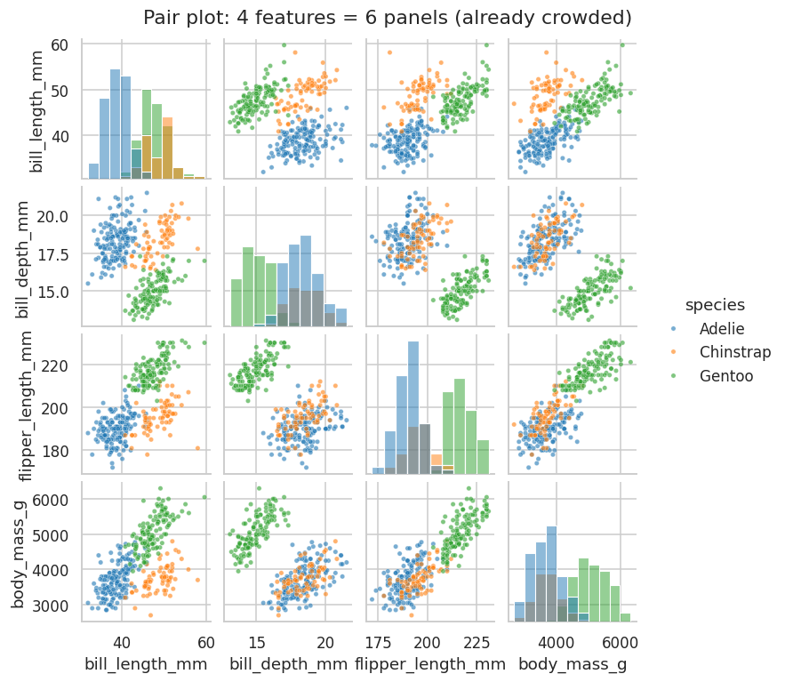
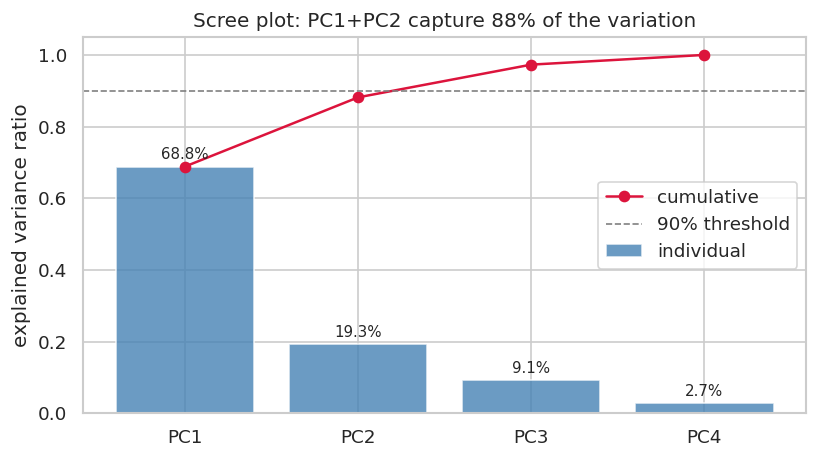

## Learning Objectives

By the end of this lesson you will be able to:

- **Explain** why visualizing many variables is hard — the pairwise-plot explosion — and **use** a parallel coordinates plot to show several variables in one figure. *(Understand / Apply)*
- **Apply** standardization before PCA and **justify** why unscaled features wreck the result. *(Apply / Analyze)*
- **Compute** a PCA, **interpret** its explained-variance ratio with a scree plot, and **project** the data to a 2D scatter. *(Apply)*
- **Identify** groups and outliers in the projection and **interpret** the loadings — what each new axis means. *(Analyze)*

> **Where this sits:** after **L13** traced patterns in *time* · this lesson handles *many variables* at once · it closes Unit V (Visualization); next, Unit VI opens recommender systems.

> **Hands-on:** [Lab — Four Measurements, Three Species: PCA on Penguins](l14_lab_penguins_pca.md) ·
> 

## Why This Matters

L08 gave you two tools for relationships between variables: the scatter
plot for two, and the pair plot for several at once. But the pair plot has
a hard ceiling. It draws every variable against every other, so the number
of panels grows as the *square* of the variable count: 4 variables need 6
panels, 10 need 45, **30 need 435**. You cannot plot thirty dimensions,
and your eyes cannot see past three — yet real tables are exactly that
wide. A census extract carries dozens of indicators per municipio; a
genome, thousands of measurements per person.

The standard escape is not to plot every variable but to **reduce** them:
build a handful of new, composite variables that keep most of the
variation, then plot those. The headline method is **principal component
analysis (PCA)**. To see it work, we use a dataset small enough to check
against intuition — 342 penguins, each measured four ways — and watch PCA
recover the three species *without ever being told what a species is*:

**Reading the output:** four measurements per penguin, collapsed to one
picture — and the biology falls out. Two axes hold 88% of everything the
four measurements captured, the three species form distinct clouds, and
the one extreme penguin is impossible to miss. That is what dimensionality
reduction buys: structure you could only glimpse across six pair-plot
panels, readable at a glance.

## Seeing Many Variables Directly

Before reducing, it is worth seeing how far direct plotting goes. The pair
plot still works at four features — the species already cluster — but you
read it one panel at a time, and the grid is near its useful limit:

A different tactic puts every variable on its own vertical axis and draws
one line per row across all of them — a **parallel coordinates** plot
(standardize the axes first, since the units differ):

**Reading the output:** each penguin is now a single line, and Gentoo's
shape signature — long flippers, heavy body, *shallow* bill — is visible in
one figure rather than six panels. The weaknesses are real, though: the
picture depends on the order of the axes, and a few hundred lines already
begin to tangle. At thirty variables it becomes spaghetti. Direct plotting
delays the ceiling; it does not remove it.

## The Idea of Dimensionality Reduction

The key move is counterintuitive: don't *drop* variables, **combine** them.
If flipper length and body mass nearly always rise together, they are
partly telling the same story — "size" — and a single new axis can carry
most of what both held. Dimensionality reduction looks for a few such
composite axes that preserve as much of the data's *variation* as possible.

> **Analogy:** a sculpture is three-dimensional, but a skilled photographer
> picks the one camera angle that reveals the most about its shape in a
> flat photo. PCA is that choice made arithmetic: among all the ways to
> flatten the data, it picks the view that keeps the most spread.

## Standardize First

PCA finds the directions of greatest *variance* — which makes it dangerously
sensitive to units. The penguin features span wildly different ranges:
body mass varies by about 800 (grams), bill depth by about 2 (millimeters).
Run PCA on the raw numbers and the grams column drowns everything:

**Reading the output:** unscaled (left), PC1's loading on body mass is
**1.00** and every other feature rounds to zero — PCA has merely renamed
the grams column. The heaviest species (Gentoo) peels off on that single
axis, but the two lighter species, similar in mass, stay smeared together.
After `StandardScaler` rescales each feature to mean 0 and standard
deviation 1 (L13's z-score, packaged as a reusable transformer), every
feature gets an equal vote and all three species separate cleanly (right).

::: {.callout-important title="Standardizing is not optional for PCA"}
Whenever your features are in different units — grams and millimeters,
dollars and years, counts and percentages — standardize before PCA, or the
largest-numbered column hijacks the result. The library will not warn you;
the unscaled answer looks perfectly valid and is perfectly meaningless. The
one time you can skip it: features already on the same scale (e.g. all
z-scored, or pixels of one image).
:::

## Principal Component Analysis

With standardized features, PCA builds new axes called **principal
components**. PC1 points in the direction of greatest variation in the
data; PC2 in the next-greatest direction *perpendicular* to PC1; and so on.
Each component reports how much of the total spread it captures — its
**explained variance ratio**. A **scree plot** lays them out:

**Reading the output:** PC1 alone holds 68.8% of all the variation among
penguins, PC2 another 19.3% — **two new axes carry 88% of what four
measured ones held**, so a 2D scatter of PC1 against PC2 loses almost
nothing. The bars fall off a cliff after PC2 (the "elbow"): that drop is
the visual cue for how many components are worth keeping. A stricter rule —
keep enough to reach 90% of the variance — would take three here. "How
many components" is a judgment call between those two readings.

## Reading the Projection

Two questions finish the analysis: what do the axes *mean*, and what does
the scatter *show*. The **loadings** answer the first — they say how each
original feature contributes to each component. For the penguins, PC1 loads
positively on flipper length, body mass, and bill length but negatively on
bill depth: an **overall size** axis (the big, shallow-billed Gentoo
build). PC2 is almost all bill measurements: a **bill shape** axis. A
component is never a single feature; it is a *blend*, and reading its
loadings is how you name it. Drawn as arrows on the scatter, the loadings
make a **biplot** (the arrows in this lesson's opening figure).

The scatter itself answers the second question — and it is where **groups
and outliers** become visible. The three species, whose labels PCA never
saw, form three clouds: Gentoo far along PC1 (mean PC1 +2.01, the big
ones), Adelie and Chinstrap overlapping on size but split on PC2 by bill
shape. PCA rediscovered the biology from four numbers per bird. The lone
penguin in the far corner is an **outlier** — extreme on both axes at once
(the lab tracks down exactly which bird and why) — the kind of point an
analyst should always inspect before trusting a model.

## When to Use Which

- **Pair plot** — a handful of variables (say $\le 6$) where you want every
  raw relationship. Honest and direct, but explodes with width.
- **Parallel coordinates** — a dozen-ish variables, to compare whole
  profiles across groups. Standardize first; mind the axis order.
- **PCA** — many variables, especially correlated ones, when you want one
  2D overview and are willing to read composite axes instead of raw ones.
- **Correlation heatmap (L08)** — when the question is *which variables
  move together*, not *how the rows cluster*. Often the right first look
  before deciding whether PCA will even help.

## Common Pitfalls

- **Forgetting to standardize.** The largest-unit column becomes PC1 and
  the rest vanish. The single most common PCA mistake.
- **Reading meaning into low-variance components.** PC4 here holds 2.7% of
  the variance — mostly noise. Interpret the components that the scree plot
  says matter, not all of them.
- **Treating PC axes as physical quantities.** "PC1" is a blend, not
  millimeters of anything. Name it from its loadings; never report it as a
  raw measurement.
- **PCA on the wrong data.** It needs numeric, roughly linearly related
  features. One-hot categorical columns, or strongly curved relationships,
  break its assumptions — and if a pair plot already answers the question,
  PCA only adds a layer of abstraction.

## Quiz Hooks

*Feeds the retrieval quiz at the start of the next session.*

- Given a dataset's variable count, pick the statement that correctly explains why a pair plot becomes unworkable, and name a tool that scales better <!-- obj 1 · Understand · Moodle MC -->
- An analyst runs PCA on raw features (grams, millimeters) and PC1 is 100% one column; diagnose the mistake and name the fix <!-- obj 2 · Apply · Moodle MC -->
- Given a scree plot / explained-variance ratio, pick how many components to keep under a stated rule (elbow vs 90% threshold) <!-- obj 3 · Apply · Moodle MC -->
- Given a 2D PCA scatter with three visible clouds and loadings, pick the correct interpretation of what PC1 means and what the clusters represent <!-- obj 4 · Analyze · Moodle MC -->

## FAQ / Industry Reality

**"Is the first component the most important variable?"** — No, and this
trips up beginners constantly. PC1 is not a variable at all; it is a
weighted blend of *all* of them, chosen to capture the most spread. "Most
variance" also is not "most important" for any particular question — a
low-variance direction can carry the signal you actually care about. PCA
ranks directions by spread, not by relevance to your goal.

**"Does PCA find the clusters for me?"** — No. PCA is *unsupervised* but it
does not assign group labels; it reveals structure that you still have to
interpret (here, we colored by a species label we already had). To have an
algorithm *assign* groups, you need a clustering method — k-means is the
usual first one — which is a separate tool, often run *on* the PCA output.
This lesson finds groups by eye; naming them automatically is the next
course's job.

**"How many components should I keep?"** — There is no single rule. Three
common ones: the **elbow** in the scree plot (where the bars flatten), a
**cumulative-variance threshold** (keep enough to reach 90%, say), or — if
PCA feeds a model — whatever number gives the best validated performance.
For *visualization* the answer is usually just two or three, because that
is what you can plot.

## Cheat-sheet

| Task | Call |
|---|---|
| Every pair of variables | `sns.pairplot(df, hue="label")` |
| Many axes, one figure | `parallel_coordinates(df, "label")` (standardize first) |
| Standardize features | `StandardScaler().fit_transform(X)` |
| Fit PCA | `PCA().fit(X_scaled)` |
| Variance per component | `pca.explained_variance_ratio_` |
| Project to 2D | `scores = pca.transform(X_scaled)` |
| What the axes mean | `pca.components_` (the loadings) |
| Cumulative variance | `np.cumsum(pca.explained_variance_ratio_)` |

## Where to Go Deeper

- **Official docs:** [scikit-learn — Decomposition (PCA)](https://scikit-learn.org/stable/modules/decomposition.html#pca) — the API, `whiten`, and the variants (incremental, kernel, sparse PCA).
- **Textbook:** J. VanderPlas, *Python Data Science Handbook* — "In Depth: Principal Component Analysis" — PCA as visualization, noise filtering, and the eigen-picture, with worked code.
- **The dataset:** [Palmer Penguins](https://allisonhorst.github.io/palmerpenguins/) — Horst, Hill & Gorman's CC0 replacement for Iris, with the measurement diagrams behind the four features.
