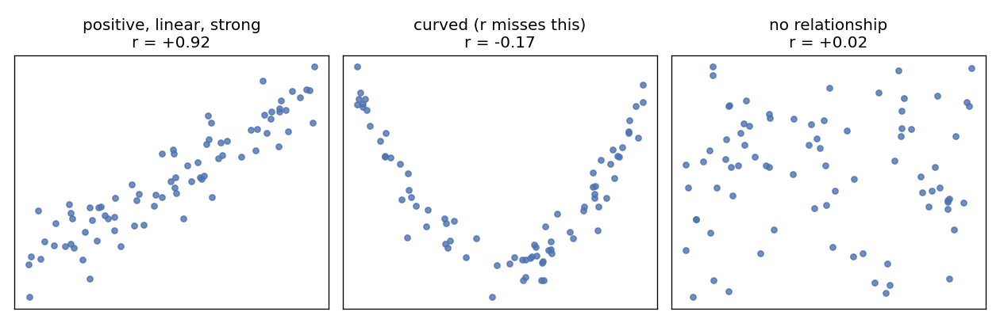
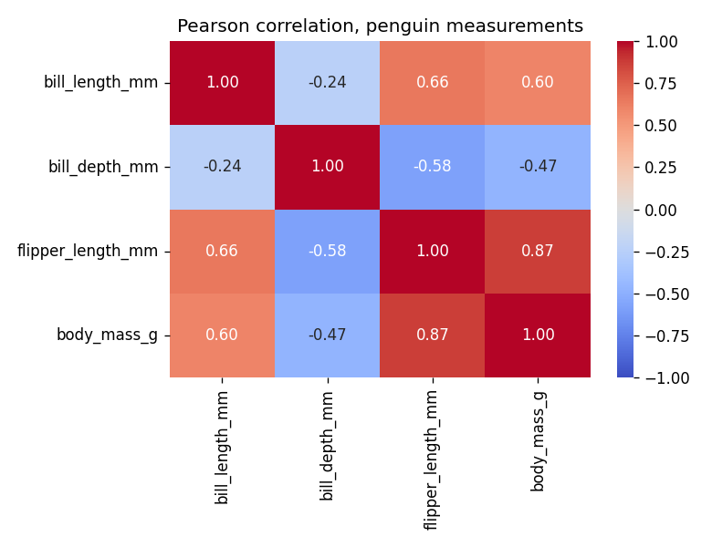

## Learning Objectives

By the end of this lesson you will be able to:

- **Compute and interpret** Pearson's r, and **connect** it to L18 — r is the cosine of the two mean-centered columns, and covariance is their dot product. *(Apply / Understand)*
- **Recognize** r's three blind spots (linear-only, outlier-sensitive, blind to groups) and **choose** Spearman when it is the honest measure. *(Analyze)*
- **Use** correlation as a predictive tool — fit a best-fit line and read r-squared as the fraction of variance it explains. *(Apply)*
- **Critique** a correlation claim — causation, confounders, and Simpson's paradox. *(Evaluate)*

> **Where this sits:** after **L18** gave you the dot product and cosine · this lesson turns them into correlation · next, **L20** uses the same vector machinery for PCA.

> **Hands-on:** [Lab — Penguin Relationships & a Paradox](l19_lab_correlation.md) ·
> [](https://colab.research.google.com/github///blob//u05_visualization/l19_lab_correlation.ipynb)

## Why This Matters

In L18 you learned that the dot product measures how *aligned* two vectors are, and that cosine
turns it into a magnitude-free score from -1 to +1. **Correlation is that exact idea applied to two
columns of data** — once you center them on their means. This lesson builds the number from L18's
machinery, then spends the rest of its time on the four ways the number can fool you. Here is the
warning, built by the statistician Francis Anscombe in 1973 — four datasets with the same mean of x
(9.0), same mean of y (7.5), same variances, and the same correlation r = 0.82:


**Reading the output:** only dataset I is what "r = 0.82" makes you imagine. II is a *curve* — a perfect
relationship r understates. III is a perfect *line* hijacked by one outlier. IV has *no* relationship —
one extreme point manufactures the whole statistic. Four identical summaries, four different stories. The
discipline: read the picture and the number together, then refuse the causal leap.

## A One-Number Summary of a Relationship

The picture is the **scatter plot** from L09 — one point per row, read with four words: *direction*
(does y rise or fall as x grows?), *form* (could a straight line describe it?), *strength* (how tightly
do points hug the form?), and *unusual points*. Correlation puts a number on the first three — but only
for the *linear* part of the form:



**Reading the output:** the first panel is what correlation measures well. The middle panel is the trap —
an obvious, strong relationship (a parabola) that r calls "-0.17, basically nothing", because the rule it
checks is *linear*. The right panel is genuine noise. The plot distinguishes the last two; the number
alone cannot.

## Measuring It: from L18's Dot Product to r

How do we put a number on "they move together"? Start with **covariance**: subtract each column's mean
(center it), then take the **dot product** of the two centered columns and divide by `n - 1`. When x and
y are both above their means on the same rows, those products are positive, so covariance is positive.
That dot product is precisely L18's operation:

```python
xc = x - x.mean()           # center column x
yc = y - y.mean()           # center column y
covariance = (xc @ yc) / (len(x) - 1)     # L18's dot product, averaged
```

Covariance has the right *sign* but useless *units* (grams times millimeters?), so its size means nothing.
**Pearson's correlation coefficient** fixes that by dividing out both standard deviations — which is
exactly L18's move from dot product to **cosine** (divide by both vectors' lengths):

$$
r = \frac{\sum_i (x_i - \bar{x})(y_i - \bar{y})}{\sqrt{\sum_i (x_i - \bar{x})^2}\,\sqrt{\sum_i (y_i - \bar{y})^2}}
  = \frac{x_c \cdot y_c}{\lVert x_c \rVert \, \lVert y_c \rVert}
$$

::: {.callout-important title="Correlation IS the cosine of the centered columns"}
Read the right-hand side: it is L18's cosine formula, with the two vectors being the **mean-centered
columns**. So Pearson's r is the cosine of the angle between the centered data vectors — `r = +1` means
they point the same way, `r = -1` opposite, `r = 0` perpendicular ("no linear alignment"). In the lab you
will compute r both with `pandas.corr()` and with L18's `xc @ yc / (norm(xc) * norm(yc))` and watch them
agree to six decimals (+0.871202 for flipper length vs body mass).
:::

That forces $-1 \le r \le +1$; the sign gives direction, the magnitude the strength of the **linear**
relationship:

| r (magnitude) | Conventional read |
|----------------|-------------------|
| 0.9 to 1.0 | very strong |
| 0.7 to 0.9 | strong |
| 0.4 to 0.7 | moderate |
| 0.1 to 0.4 | weak |
| 0.0 to 0.1 | none detected |

These bands are *conventions, not laws* — in physics r = 0.7 may be weak; in social science it may be a
career.

## r's Three Blind Spots

The bands assume you already looked at the scatter, because r is blind in three ways:

- **Linear only.** Anscombe II (and the parabola above): a real, strong, curved relationship can score
  near zero. *r = 0 does not mean "unrelated".*
- **Outlier-sensitive.** Anscombe III and IV: one point can inflate, deflate, or fabricate r — it is
  built from means and variances, which L08 showed are not robust.
- **Blind to groups.** A mixture of subgroups can produce an r that describes *none* of them — the trap
  of this lesson's final section.

### Spearman: correlation on the ranks

**Spearman's rank correlation** replaces each value with its rank, then computes Pearson on the ranks. It
answers a looser, often more honest question: *does y consistently move in one direction as x grows* —
linearly or not? A series that doubles every step makes the difference concrete:

```python
x = pd.Series(range(1, 11))
y = pd.Series(2.0 ** x)   # doubles every step: monotone but curved
x.corr(y)                     # Pearson  : 0.80
x.corr(y, method="spearman")  # Spearman : 1.00
```

The relationship is *perfectly* monotone, and Spearman says so (1.00), while Pearson docks it to 0.80 for
not being a straight line. **Prefer Spearman when** the scatter is monotone but curved, the data is
ordinal (rankings, survey scales), or outliers are present (ranks tame them). **Stay with Pearson when**
the scatter looks linear — it then uses more of the information.

## Many Pairs at Once: the Correlation Matrix

With four numeric columns there are six pairs — nobody reads six scatters one by one. `df.corr()` computes
r for every pair; a **heatmap** colors the grid so the strong cells jump out:



**Reading the output:** flipper length and body mass at **0.87** is the standout. The strange cells are
bill depth's whole row — negative against everything, including **-0.47** with body mass. (Deeper bills on
*lighter* penguins? That cell is hiding something; the lab catches it.) Note the **color choice** — this
is L16's principle in action: correlation has a meaningful midpoint at 0, so a heatmap of r wants a
**diverging** colormap (`coolwarm`: blue for negative, red for positive, white at zero), never a
sequential or rainbow ramp. The color encodes sign *and* strength at a glance.

## Correlation as a Predictive Tool

If two variables correlate, the correlation also tells you how well a straight line **predicts** one from
the other. Fit the best line through the cloud — `np.polyfit(x, y, 1)` returns its slope and intercept —
and you have a prediction rule:

```python
slope, intercept = np.polyfit(flipper, body_mass, 1)   # 49.7, -5780.8
predicted = slope * 210 + intercept                     # ~4,653 g for a 210 mm flipper
```

How good is that line? **r-squared** (literally r times r) is the fraction of the variance in y that the
line accounts for: here `r = 0.87`, so `r^2 = 0.76` — the line explains about three-quarters of the
variation in body mass, leaving a quarter to everything else. A higher |r| means a tighter cloud, which
means a line that predicts better. (This is the doorway to *regression*, a later topic; here we stop at
the one-line fit and its r-squared.) One caution: a fitted line is trustworthy only *inside* the observed
range — predict a penguin's mass from a 300 mm flipper and you have hope, not evidence.

## Correlation Is Not Causation

The most quoted sentence in statistics, and Unit V's exit exam for judgment. When x and y correlate, there
are always (at least) three candidate explanations:

1. **x causes y** — longer flippers really do add mass.
2. **y causes x** — the reverse.
3. **Something else causes both** — a **confounder** (or *lurking variable*). Ice-cream sales correlate
   with drownings; the confounder is summer.

A correlation alone cannot pick between the three — that takes experiments or domain knowledge. The most
spectacular way a confounder shows itself is:

::: {.callout-important title="Simpson's paradox"}
A correlation that holds in every subgroup can **disappear — or reverse — when the groups are pooled**.
The penguins deliver a textbook case: bill depth vs body mass has overall r = **-0.47**, yet *within every
single species* it is **positive** (+0.58 Adelie, +0.60 Chinstrap, +0.72 Gentoo). The lurking variable is
species — being a Gentoo independently makes a penguin heavier AND shallower-billed, so pooling the three
clouds tilts the line the wrong way. The lab walks you through producing and unmasking it.
:::

The practical rule: **never report a pooled correlation without checking the obvious groupings first**
(`groupby` + per-group r, or a hue-colored scatter).

## Where This Number Keeps Coming Back

This one number turns up across the course:

- **Filter feature selection (L13).** L13's filters scored each feature against the label and kept the
  top-ranked ones; `|r|` is another such filter score — a numeric-pair sibling of L13's chi-square and
  mutual-information filters, usable when both the feature and the label are numbers.
- **L17's autocorrelation.** Periodicity in a time series is just r computed between the series and a
  *lagged copy of itself*: a strong r at lag 12 means "this month resembles the same month last year". L17
  showed the 12-month cycle visually and explicitly promised the number here — this is it.

Correlation is one of the most reused numbers in data science precisely because it is so simple: a cosine
of two centered vectors.

## Common Pitfalls

- **The causal leap.** "r = 0.87, so flippers cause mass" — nothing in the number supports the verb. Say
  "associated", then argue causation separately.
- **Correlating aggregates.** Correlations on group *averages* (per-island means, per-year totals) are
  routinely stronger than the same correlation on individuals, and can even differ in sign. Say which level
  your r describes.
- **Cherry-picking the matrix.** Compute many pairs and *some* cell will show |r| > 0.5 by luck. Treat
  heatmap findings as leads, not conclusions.
- **Quoting r without asking "could this be chance?"** In a small sample a sizable r can arise from luck;
  the formal check is a significance test (a p-value for r), which exists and is taught later.
- **Extrapolating the line.** A fit holds *inside* the observed range; beyond it you have hope, not
  evidence.

## Quiz Hooks

*Feeds the retrieval quiz at the start of the next session.*

- Connect r to L18: r is the cosine of the two mean-centered columns; given that covariance is their dot product, pick what dividing by both lengths achieves (a unit-free -1..+1 score) 
- Read a described scatter (curved / outlier-driven / monotone-but-not-linear) and pick when Spearman is the honest choice over Pearson 
- Given r (and r-squared), interpret correlation as prediction: what fraction of variance a best-fit line explains, and the extrapolation caveat 
- A Simpson's-paradox scenario (pooled r vs per-group r): which conclusion is justified? 

## FAQ / Industry Reality

**"Is r = 0.9 always better evidence than r = 0.5?"** — Better evidence *of linear association in your
sample*, yes. But an r = 0.9 from ten cherry-picked points, a pooled mixture, or one outlier (Anscombe
IV!) is worth less than an honest 0.5 from clean, plotted, group-checked data. The number's pedigree
matters more than its size.

**"My heatmap shows 0.97 between two features — jackpot?"** — More often a red flag: near-perfect
correlation usually means the two columns encode the *same thing* (mass in grams and in kilograms). In
modeling that redundancy causes trouble; the professional reflex to a 0.97 cell is "which one do I drop?"
(exactly L13's redundancy concern), not "what a discovery".

## Cheat-sheet

| Question | Plot | Number |
|----------|------|--------|
| Do two numeric variables move together? | scatter plot (L09) | Pearson's r = `x.corr(y)` |
| ...monotone but curved? ordinal? outliers? | scatter plot | **Spearman** `method="spearman"` |
| Which pairs matter, among many? | heatmap (diverging cmap) | `df.corr()` matrix |
| How well does x predict y? | scatter + best-fit line | `np.polyfit(x, y, 1)`; r-squared |
| Is the pooled correlation honest? | scatter with `hue=` group | per-group r vs overall r |

## Where to Go Deeper

- **Book chapter:** [R for Data Science — Exploratory Data Analysis](https://r4ds.hadley.nz/eda) — covariation, the same discipline in another language.
- **Official docs:** [pandas — `DataFrame.corr`](https://pandas.pydata.org/docs/reference/api/pandas.DataFrame.corr.html) · [NumPy — `polyfit`](https://numpy.org/doc/stable/reference/generated/numpy.polyfit.html).
- **Classics:** Anscombe, F. J. (1973). "Graphs in Statistical Analysis", *The American Statistician* 27(1) · [Spurious Correlations (tylervigen.com)](https://www.tylervigen.com/spurious-correlations) — a gallery of confounders and coincidences.
